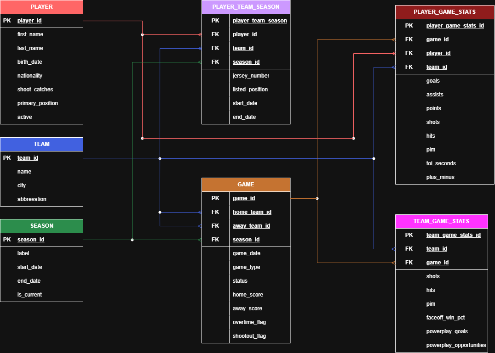

# NHL-databas

*Slutprojekt i Databaser (YH25)*

**Gabriel Gustafsson & Carlos Johansson Bergqvist**

---

Projektbeskrivning

I det här projektet har vi byggt en relationsdatabas för NHL-statistik. Tanken är att kunna lagra data från matcher och sedan använda den för att analysera hur spelare presterar.

Vi har valt att fokusera på statistik som:

* Mål
* Assist
* Poäng (goals + assists)
* Tacklingar (hits)
* Skott (shots)
* Utvisningsminuter (PIM)
* Speltid (TOI)
* +/-  (plus/minus)

Databasen är också gjord för att kunna hantera flera säsonger, så att man kan jämföra spelare över tid.

---

## Databasdesign

### Tabeller

Databasen består av följande huvudtabeller:

* **player** – information om spelare
* **team** – laginformation
* **season** – säsonger
* **game** – matcher
* **player_team_season** – koppling mellan spelare, lag och säsong
* **player_game_stats** – spelarstatistik per match
* **team_game_stats** – lagstatistik per match

---

## Relationer

* En spelare kan spela i flera lag över olika säsonger
* En match spelas mellan två lag
* Statistik lagras per spelare och match
* Statistik aggregeras per säsong via queries

---

## Funktionalitet

### Triggers

Automatisk beräkning av poäng:

* `points = goals + assists`

Triggers körs vid:

* INSERT
* UPDATE

---

### Stored Procedure

```sql
CALL get_points_leaderboard_by_season(season_id);
```

Får tillbaka en leaderboard över spelare baserat på total poäng för en specifik säsong.

---

## Exempel på queries

### Poängliga

```sql
SELECT p.first_name, p.last_name, SUM(pgs.points) AS total_points
FROM player_game_stats pgs
JOIN player p ON p.player_id = pgs.player_id
JOIN game g ON g.game_id = pgs.game_id
WHERE g.season_id = 20232024
GROUP BY p.player_id
ORDER BY total_points DESC;
```

### Tacklingsliga

```sql
SELECT p.first_name, p.last_name, SUM(pgs.hits) AS total_hits
FROM player_game_stats pgs
JOIN player p ON p.player_id = pgs.player_id
JOIN game g ON g.game_id = pgs.game_id
WHERE g.season_id = 20232024
GROUP BY p.player_id
ORDER BY total_hits DESC;
```

---

## Testdata

Projektet innehåller testdata för:

* 2 lag
* 1 säsong
* 4 spelare
* 1 match
* Statistik för både spelare och lag

---

## ER-diagram

Databasens struktur visas här:



---

## Lärdomar

* Spännande projekt att få bygga en lite större databas
* Fortsätta lära oss mer om triggers och hur man använder dom
* Stored procedures för återanvändbar logik
* Indexering för bättre prestanda

---

## Möjlig vidareutveckling

* Bygga en webbapplikation (frontend + API)
* Importera live-data via NHL API
* Visualisering av data
* Avancerad statistik (t.ex. Corsi, xG)

---

## Filer i projektet

* `README.md`
* `Databas-projekt.drawio.png`
* `nhl_database.sql`

---

### 🚧 Status

**WORK IN PROGRESS**

*Ändringar kommer ske med tiden*
